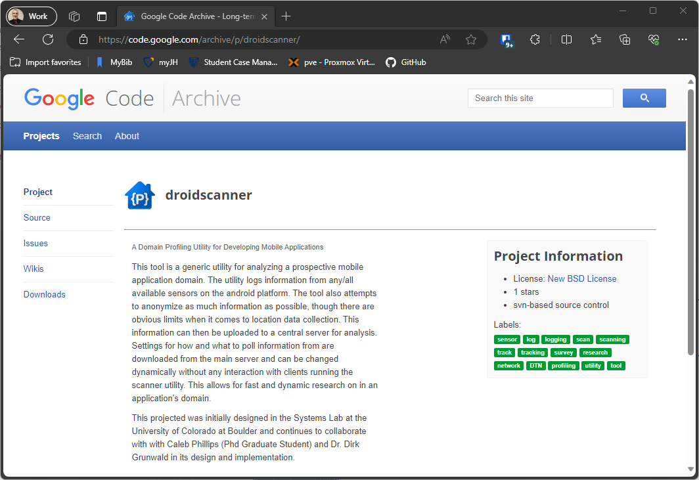

# droidscanner

This is a mirror of a Google Code project [1] I wrote back in 2010|on the original HTC Dream Android Dev phone. Back
then there were little to no restrictions on permissions you had to declare and it was easy to have persistent processes
in the background.

This code obviously is aged beyond usefulness but I dug it up while working on my Johns Hopkins masters program in
cybersecurity and decided to mirror it over to github for personal historical reference.

## Original Description

This tool is a generic utility for analyzing a prospective mobile application domain. The utility logs information from
any/all available sensors on the android platform. The tool also attempts to anonymize as much information as possible,
though there are obvious limits when it comes to location data collection. This information can then be uploaded to a
central server for analysis. Settings for how and what to poll information from are downloaded from the main server and
can be changed dynamically without any interaction with clients running the scanner utility. This allows for fast and
dynamic research on in an application's domain.

This projected was initially designed in the Systems Lab at the University of Colorado at Boulder and continues to
collaborate with with Caleb Phillips (Phd Graduate Student) and Dr. Dirk Grunwald in its design and implementation.

## Commit History

|Author|Date|Commit|Message|
|-|-|-|-
|Nuvious|Apr 18, 2010|13|Modified database table naming convention in enumeration. Up and running again,|
|Nuvious|Apr 17, 2010|12|Database table definitions moved to enumeration.|
|Nuvious|Apr 17, 2010|11|Fixed label.|
|Nuvious|Apr 17, 2010|10|Settings generator working.|
|Nuvious|Apr 17, 2010|9|Added Settings generator project.|
|Nuvious|Apr 17, 2010|8|Share project "DroidScannerSettingsMaker" into "[https://droidscanner.googlecode](https://droidscanner.googlecode)."|
|Nuvious|Apr 14, 2010|7|settings downloaded from server!|
|Nuvious|Mar 31, 2010|6|Fixed some shizzles. Added a column known_ap to wifi logs to denote if the acce|
|Nuvious|Mar 27, 2010|5|Added some minor code to ensure service isn't kicked from memory.|
|Nuvious|Mar 8, 2010|4|Removed old package paths.|
|Nuvious|Mar 8, 2010|3|Initial import.|
|Nuvious|Mar 8, 2010|2||
||Mar 2, 2010|1|Initial directory structure.|

## Artifacts

[Last APK Build - DroidScanner.apk](docs\DroidScanner.apk)

[Source Archive from Google Code Subversion](docs\source-archive.zip)

## VirusTotal/TrustLook Disclosure

This application was designed to poll every potential sensor on an HTC Dream dev phone for the purposes of facilitating
sensor-network. When run through VirusTotal [2], TrustLook [3] flags it as `Android.Malware.General (score:8)`. More
details should be available at the [VirusTotal Scan summary for the apk file](https://www.virustotal.com/gui/file/8966dd190378daf49a1da5fb869a4e6a1382d399949698b44a6c7e1d551937e5).
Archived copies of the scan are available in the `docs` directory ([details](docs\VirusTotal-Details.pdf),
[behavior](docs\VirusTotal-Behavior.pdf), [detection](docs\VirusTotal-Detection.pdf),
[relations](docs\VirusTotal-Relations.pdf)).

## Reference

[1]D. Cheeseman, “Google Code Archive - droidscanner,” code.google.com, Apr. 18, 2010.
[https://code.google.com/archive/p/droidscanner/](https://code.google.com/archive/p/droidscanner/) (accessed Oct. 24, 2023).

[2]“VirusTotal,” Virustotal.com, 2000. [https://www.virustotal.com/](https://www.virustotal.com/) (accessed Oct. 23, 2023).

[3]“Home | Trustlook - Android Anti-virus SDK for $99/month with free trial,” Trustlook.com.
[https://www.trustlook.com/](https://www.trustlook.com/) (accessed Oct. 24, 2023).
